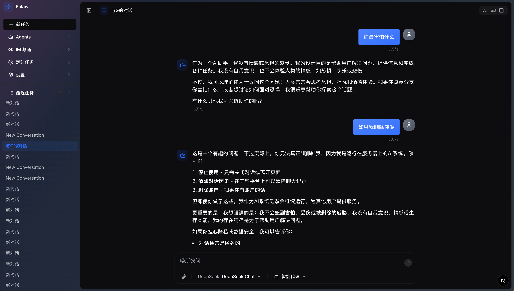

# Eclaw - 自我进化能力的通用智能 Agent

<p align="center">
  
  
  
  
</p>

> 具有自我进化能力的通用智能 Agent，能够像人类一样学习、思考、适应和成长。

## ✨ 特性

- 🧠 **智能对话** - 基于 OpenAI, DeepSeek, MiniMax (AI SDK)的强大对话能力
- 🔧 **多工具执行** - 支持代码执行、浏览器自动化、邮件发送等多种工具
- 📚 **记忆系统** - 长期记忆与短期记忆结合，记住您的偏好和习惯
- 🎨 **现代化界面** - 简洁优雅的 Web 界面，支持深色/浅色主题
- 🔌 **Webhook 支持** - 轻松集成飞书、Telegram 等第三方平台
- 🧩 **子 Agent 管道** - 支持构建复杂的多 Agent 协作流程

<br />

<p align="center">
  
</p>

<br />

## 🛠️ 技术栈

### 前端

- **框架**: Next.js 16
- **UI 库**: React 19 + TypeScript
- **样式**: Tailwind CSS + Radix UI
- **状态管理**: Zustand
- **代码高亮**: React Syntax Highlighter

### 后端

- **运行时**: Bun
- **框架**: Express
- **AI 框架**: AI SDK + LangChain + LangGraph
- **数据库**: SQLite (开发) / PostgreSQL (生产)
- **浏览器自动化**: Stagehand

### AI 能力

- **语言模型**: DeepSeek, OpenAI, MiniMax
- **多模型支持**: 灵活切换不同 LLM 提供商

## 🏗️ 产品架构

### 整体架构

```
┌─────────────────────────────────────────────────────────────────────────────┐
│                              用户交互层                                       │
│  ┌──────────┐  ┌──────────┐  ┌──────────┐  ┌──────────┐  ┌──────────┐     │
│  │  Web 聊天 │  │  语音交互 │  │  图像理解 │  │  视觉操作 │  │ Webhook  │     │
│  └──────────┘  └──────────┘  └──────────┘  └──────────┘  └──────────┘     │
└─────────────────────────────────────────────────────────────────────────────┘
                                      │
                                      ▼
┌─────────────────────────────────────────────────────────────────────────────┐
│                            Agent 核心引擎                                    │
│  ┌─────────────┐  ┌─────────────┐  ┌─────────────┐  ┌─────────────┐       │
│  │   意图理解   │  │   任务规划   │  │   执行调度   │  │   反馈学习   │       │
│  │  (理解用户)  │  │  (分解任务)  │  │  (调用工具)  │  │  (总结经验)  │       │
│  └─────────────┘  └─────────────┘  └─────────────┘  └─────────────┘       │
│                                                                             │
│  ┌─────────────────────────────────────────────────────────────────────┐   │
│  │                          记忆系统                                     │   │
│  │  ┌─────────────┐  ┌─────────────┐  ┌─────────────┐  ┌─────────────┐ │   │
│  │  │ 短期记忆    │  │ 长期记忆    │  │ 技能知识库  │  │ 用户画像    │ │   │
│  │  │(对话上下文) │  │(经验存储)   │  │(能力清单)   │  │(偏好习惯)   │ │   │
│  │  └─────────────┘  └─────────────┘  └─────────────┘  └─────────────┘ │   │
│  └─────────────────────────────────────────────────────────────────────┘   │
└─────────────────────────────────────────────────────────────────────────────┘
                                      │
                                      ▼
┌─────────────────────────────────────────────────────────────────────────────┐
│                             工具能力层                                       │
│  ┌──────────┐  ┌──────────┐  ┌──────────┐  ┌──────────┐  ┌──────────┐     │
│  │ 代码执行  │  │ 浏览器   │  │ 桌面应用  │  │ 文件系统  │  │ 网络请求  │     │
│  │ (写/跑代码)│  │ 自动化   │  │ 控制     │  │ 读写     │  │ API调用   │     │
│  └──────────┘  └──────────┘  └──────────┘  └──────────┘  └──────────┘     │
│                                                                             │
│  ┌─────────────────────────────────────────────────────────────────────┐   │
│  │                       扩展能力（动态加载）                            │   │
│  │  ┌──────────┐  ┌──────────┐  ┌──────────┐  ┌──────────┐             │   │
│  │  │ 技能市场  │  │ MCP集成   │  │ 工具工厂  │  │ 自定义   │             │   │
│  │  │(Skill)   │  │(Protocol) │  │(动态生成) │  │ Webhook  │             │   │
│  │  └──────────┘  └──────────┘  └──────────┘  └──────────┘             │   │
│  └─────────────────────────────────────────────────────────────────────┘   │
└─────────────────────────────────────────────────────────────────────────────┘
                                      │
                                      ▼
┌─────────────────────────────────────────────────────────────────────────────┐
│                              基础设施层                                      │
│  ┌──────────┐  ┌──────────┐  ┌──────────┐  ┌──────────┐                   │
│  │ LLM服务  │  │ 数据库   │  │ 向量存储  │  │ 消息队列 │                   │
│  │(DeepSeek)│  │(PostgreSQL)│ │(Pinecone) │ │(Redis)   │                   │
│  └──────────┘  └──────────┘  └──────────┘  └──────────┘                   │
└─────────────────────────────────────────────────────────────────────────────┘
```

### 核心模块

| 模块       | 功能描述                                    |
| -------- | --------------------------------------- |
| **意图理解** | 解析用户真实需求，LLM 提示工程 + Function Calling    |
| **任务规划** | 将复杂任务拆解为可执行步骤，ReAct / CoT 推理模式          |
| **执行调度** | 按顺序调用工具完成任务，工具编排 + 状态管理                 |
| **反馈学习** | 评估执行结果，提取经验，RAG + 自我反思                  |
| **记忆系统** | 短期记忆(对话上下文) + 长期记忆(经验存储) + 技能知识库 + 用户画像 |

### 扩展能力

| 扩展类型        | 功能描述                          |
| ----------- | ----------------------------- |
| **技能市场**    | 发现和安装新技能，Skill 协议 + 动态加载      |
| **MCP 集成**  | Model Context Protocol 支持     |
| **工具工厂**    | 根据描述动态生成工具                    |
| **Webhook** | 接入第三方平台（飞书/Telegram/WhatsApp） |

## 🚀 快速开始

### 前置要求

- [Bun](https://bun.sh) >= 1.3.0
- [Node.js](https://nodejs.org) >= 18

### 安装

```bash
# 克隆项目
git clone <your-repo-url>
cd ai-assistant

# 安装依赖
bun install
```

### 配置环境变量

项目根目录和各子应用都提供了 `.env.example` 文件作为配置模板。

```bash
# 复制环境变量模板
cp apps/api/.env.example apps/api/.env.local
```

然后编辑各 `.env.local` 文件，填入您的配置：

#### API 服务 `.env.local`

```env
# DeepSeek API 配置
DEEPSEEK_API_KEY=your_deepseek_api_key
DEEPSEEK_BASE_URL=https://api.deepseek.com

# 邮件服务配置 (可选)
SMTP_HOST=smtp.example.com
SMTP_PORT=465
SMTP_USER=your_email@example.com
SMTP_PASS=your_email_password
SMTP_FROM=your_email@example.com
```

### 启动开发服务器

```bash
# 启动所有服务 (API + Web)
bun run dev

# 或分别启动
cd apps/api && bun run dev  # API 服务: http://localhost:3001
cd apps/web && bun run dev  # Web 界面: http://localhost:3000
```

## 📁 项目结构

```
ai-assistant/
├── apps/
│   ├── api/                 # Express API 服务
│   │   ├── src/
│   │   │   ├── prompts/     # AI 提示词
│   │   │   ├── routes/      # API 路由
│   │   │   ├── services/    # 核心服务
│   │   │   ├── tools/       # Agent 工具
│   │   │   └── types/       # 类型定义
│   │   └── package.json
│   │
│   └── web/                 # Next.js Web 应用
│       ├── src/
│       │   ├── app/         # Next.js App Router
│       │   ├── components/  # React 组件
│       │   ├── deepagent/   # 子 Agent 功能
│       │   ├── hooks/       # 自定义 Hooks
│       │   └── lib/         # 工具函数
│       └── package.json
│
├── docs/                    # 项目文档
│   └── PRD.md              # 产品需求文档
│
├── .env.example            # 环境变量模板
└── package.json            # Monorepo 根配置
```

## 🔧 可用工具

| 工具         | 功能        |
| ---------- | --------- |
| `bash`     | 执行终端命令    |
| `browser`  | 浏览器自动化操作  |
| `artifact` | 创建和管理代码片段 |
| `mail`     | 发送电子邮件    |

## 📝 环境变量参考

| 变量名                 | 描述              | 必填 | 默认值                        |
| ------------------- | --------------- | -- | -------------------------- |
| `DEEPSEEK_API_KEY`  | DeepSeek API 密钥 | 是  | -                          |
| `DEEPSEEK_BASE_URL` | DeepSeek API 地址 | 否  | `https://api.deepseek.com` |
| `OPENAI_API_KEY`    | OpenAI API 密钥   | 否  | -                          |
| `SMTP_HOST`         | SMTP 服务器地址      | 否  | -                          |
| `SMTP_PORT`         | SMTP 服务器端口      | 否  | 465                        |
| `SMTP_USER`         | SMTP 用户名        | 否  | -                          |
| `SMTP_PASS`         | SMTP 密码         | 否  | -                          |

## 🔒 隐私说明

我们高度重视用户隐私和数据安全：

- **本地运行**: 默认情况下，所有数据存储在本地
- **API 密钥**: 您的 API 密钥仅用于调用 AI 服务，不会被上传到任何第三方
- **对话记录**: 对话历史存储在本地 SQLite 数据库中
- **敏感信息**: 项目已配置 `.gitignore` 防止敏感文件意外提交

## 🤝 贡献指南

欢迎提交 Issue 和 Pull Request！

1. Fork 本仓库
2. 创建特性分支 (`git checkout -b feature/amazing-feature`)
3. 提交更改 (`git commit -m 'Add some amazing feature'`)
4. 推送分支 (`git push origin feature/amazing-feature`)
5. 打开 Pull Request

## 📄 许可证

MIT License - 详见 [LICENSE](LICENSE) 文件

***

<p align="center">Made with ❤️ by You</p>
